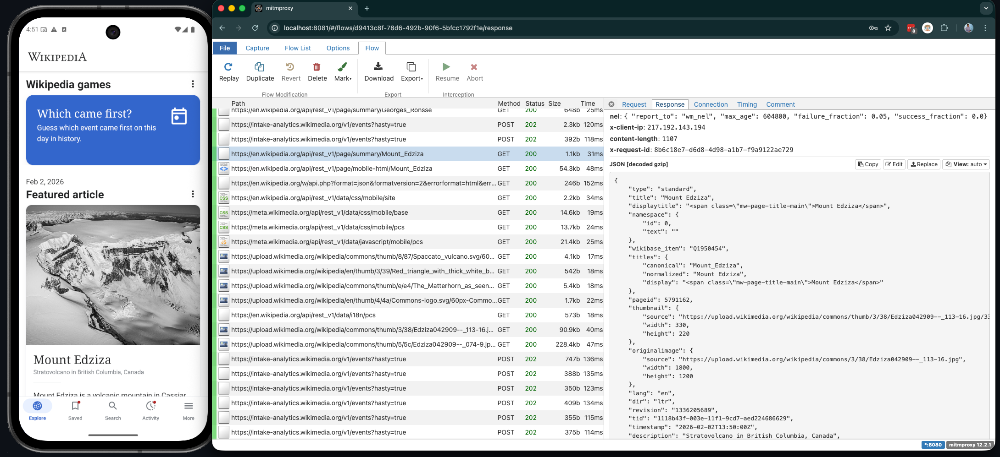

# Android Make APK Debuggable

Extracts APKs from a connected Android device, makes them debuggable, and reinstalls — all in one command.

> macOS only — uses BSD `sed` and searches macOS-specific paths for Android Studio and JDK.

## Why?

Release APKs ship without the `android:debuggable` flag, which locks out most development tools. This project patches that flag back in so you can:

- **Inspect layouts and view hierarchies** with [Android Studio's Layout Inspector](https://developer.android.com/studio/debug/layout-inspector) — useful for understanding how a third-party app builds its UI, debugging rendering issues, or reverse-engineering screen flows.
- **Attach a debugger** to a running process via Android Studio's "Attach Debugger to Android Process", allowing you to set breakpoints and step through code in apps you don't have the source for.
- **Intercept HTTPS traffic** with [mitmproxy](https://mitmproxy.org/) (via the `--proxy` flag) — the script also patches the app's network security config to trust user-installed CA certificates, which Android blocks by default since API 24. This lets you inspect API requests, debug authentication flows, or audit data the app sends over the network.

Example: intercepting Wikipedia's API calls with mitmproxy after patching the app with `./apk-debuggable.sh wikipedia --proxy`:



## Requirements

| Tool | Purpose | Install |
|------|---------|---------|
| [Android SDK](https://developer.android.com/studio) | `adb`, `apksigner` | Included with [Android Studio](https://developer.android.com/studio) |
| [Java / JDK](https://adoptium.net/) | `keytool` | Bundled with Android Studio, or `brew install --cask temurin` |
| [apktool](https://apktool.org/) | APK disassembly / reassembly | `brew install apktool` |
| [Docker](https://www.docker.com/products/docker-desktop/) | mitmproxy container (`--proxy` only) | [Docker Desktop](https://www.docker.com/products/docker-desktop/) |

## Usage

```bash
# Search for an app by name, extract, patch, and reinstall
./apk-debuggable.sh myapp

# Specify a device if multiple are connected
./apk-debuggable.sh myapp --device emulator-5554

# Keep intermediate files for inspection
./apk-debuggable.sh myapp --keep

# Intercept HTTPS traffic with mitmproxy (requires Docker)
./apk-debuggable.sh myapp --proxy
```

The script will:
1. Find connected devices (interactive menu if multiple)
2. Search for matching packages (interactive menu if multiple)
3. Pull APKs from the device
4. Make them debuggable (via `lib/make-debuggable.sh`)
5. Uninstall the original and install the debuggable version

### Options

| Flag | Description |
|------|-------------|
| `--device <serial>` | Use a specific device (from `adb devices`) |
| `--keep` | Keep intermediate files (pulled APKs and patched APKs) |
| `--trust-user-certs` | Trust user-installed CA certificates (for HTTPS interception) |
| `--proxy` | Start mitmproxy in Docker (implies `--trust-user-certs`, requires Docker) |

## Traffic Interception (mitmproxy)

The `--proxy` flag handles everything — makes the app debuggable, patches it to trust user CA certs, reinstalls it, starts mitmproxy in Docker, and pushes the CA certificate to the device:

```bash
./apk-debuggable.sh myapp --proxy
```

Then install the CA certificate on the device:

1. Open **Settings** → search **"certificate"**
2. Tap **"Install a certificate"** → **"CA certificate"**
3. Tap **"Install anyway"**
4. Select **"mitmproxy-ca-cert.cer"** from internal storage

Open the mitmproxy web UI to inspect traffic:

```
http://localhost:8081
Password: proxy
```

Stop the proxy when done:

```bash
docker stop mitmproxy-android
```

## Advanced / Standalone Usage

The helper scripts in `lib/` can be used independently for more control over individual steps. See [lib/README.md](lib/README.md) for details on:

- **`lib/make-debuggable.sh`** — Patch a single APK or split APK directory to be debuggable
- **`lib/proxy-setup.sh`** — Start mitmproxy and restart an emulator with proxy enabled
